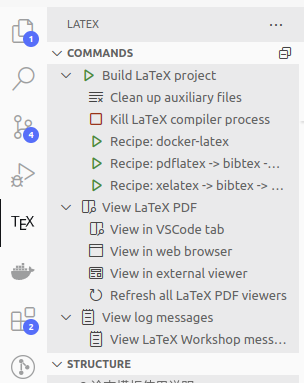

# 湖南大学学位论文模版

## 简介

本项目是湖南大学学位论文 latex 模版，适配 Vscode，默认使用 docker 作为 latex 编译后端，更加方便本地部署与使用，基于师兄的开源模版修改而来 [HNU_DoctoralThesis_Latex](https://github.com/Jeffrey28/HNU_DoctoralThesis_Latex),在这里感谢师兄的无私奉献。

## 使用方法

### 1. 安装 docker

linux 发行版参考：https://docs.docker.com/desktop/setup/install/linux/
Mac 版本未经测试，但是应该可以参考：https://docs.docker.com/desktop/setup/install/mac-install/

### 2. 安装 Vscode

略

### 3. 安装必要 Vscode 插件

为了支持 latex 编译，需要安装插件**LaTeX Workshop**


### 4. 下载 Docker 镜像

本文采用的是`leplusorg/latex`镜像，可以通过以下命令下载：

```bash
docker pull leplusorg/latex
```

### 4. 修改配置文件

由于一系列的原因，配置文件不能支持相对路径，所以需要针对修改配置文件到**你的存放该项目的绝对路径**，具体修改方法如下：

- 在项目根目录下找到`.vscode/settings.json`文件
- 修改`"latex-workshop.latex.tools"`下 Docker 相关命令为你的绝对路径，如下面代码中的`/you/path/to/project`,**这一步相当关键请务必保证操作正确**：

```json
"latex-workshop.latex.tools": [
		{
			"name": "docker-latex",
			"command": "docker",
			"args": [
				"run",
				"-v",
				"/you/path/to/project:/workspace", // 将当前工作区挂载到容器中
				"-w",
				"/workspace", // 设置容器中的工作目录
				"leplusorg/latex", // 使用的 Docker 镜像
				"xelatex", // 使用 xelatex
				"-synctex=1", // 启用 Synctex
				"-interaction=nonstopmode", // 防止中断编译
				// "Master-thesis.tex"  // 自动使用当前打开的文件
				"%DOCFILE%" // 自动使用当前打开的文件
			]
		},
		{
			"name": "docker-bibtex",
			"command": "docker",
			"args": [
				"run",
				"-v",
				"/you/path/to/project:/workspace", // 将当前工作区挂载到容器中
				"-w",
				"/workspace", // 设置容器中的工作目录
				"leplusorg/latex", // 使用的 Docker 镜像
				"bibtex", // 使用 bibtex
				"%DOCFILE%" // 自动使用当前打开的文件
			]
		},
```

由于编译过程中进行了到镜像的搬运，所以需要后续修改相关信息到本机的物理路径，在这里采用了编译流程中加入脚本的方式，需要保证您的系统中有`sed`命令，如果没有请自行安装。

### 5. 编译

如果上述配置没有问题，那么可以左边的插件目录中找到`LaTeX Workshop`，点击`Build LaTeX project`即可开始编译，编译完成后会在项目根目录生成`Master-thesis.pdf`文件。

也可以通过`Ctrl+S`保存文件时自动编译，配置文件中已经做了相关配置。
